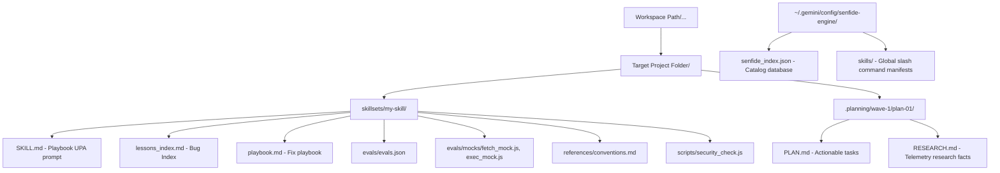
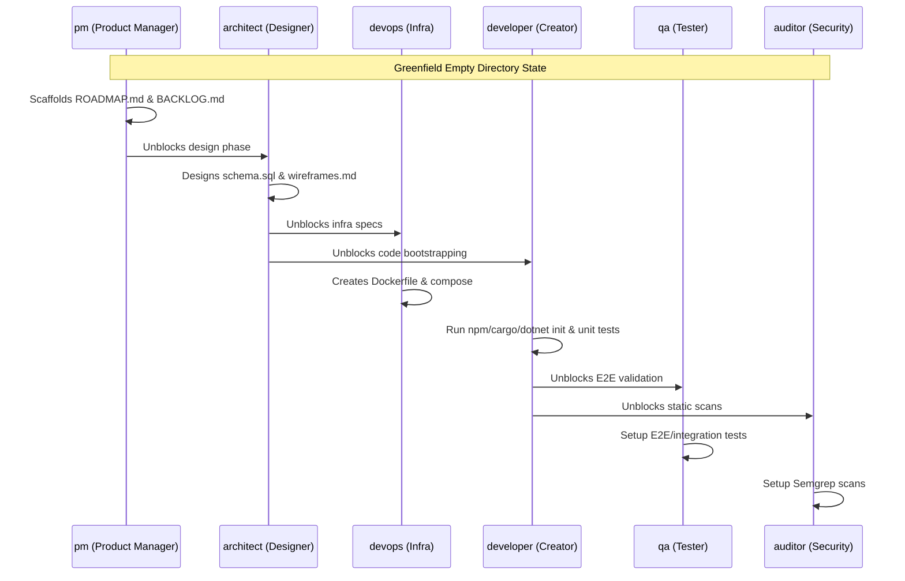
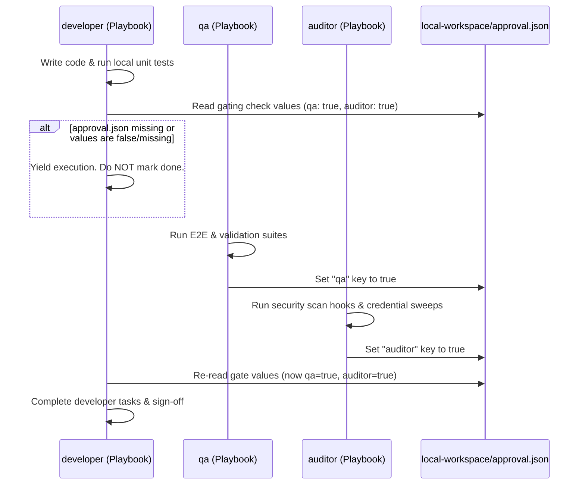

# Senfide-documentation.md — Senfide Engine Guide (Caveman Style)

> [!NOTE]
> Dense, high-density documentation for Senfide Engine toolset. Future-proof. Covers architectures, commands, prompting, and tests.

---

## 🛠️ 1. System Architecture & Workspace Footprint

`sfe` is a zero-dependency, security-first command-line engine and hook generator. It operates locally within user workspaces but maintains global registry states.

### Workspace Footprint Map


### Config Directories (Isolated):
*   **Root configuration**: `~/.gemini/config/senfide-engine/` (resolved platform-agnostically via `os.homedir()`).
*   **Registry Catalog database**: `~/.gemini/config/senfide-engine/senfide_index.json`
*   **Global Slash Command manifests**: `~/.gemini/config/senfide-engine/skills/`

---

## 📝 2. Unified Prompt Architecture (UPA) & Tag Specifications

Every play and skill template conforms strictly to the **Unified Prompt Architecture (UPA)**, maximizing prefix-caching efficiencies and structuring instructions to guide reasoning.

### UPA Tag Meanings & Intent
The UPA prompt is partitioned into structured XML nodes. Each tag has a specific semantic intent:
*   `<instructions>`: The root container for the agent's playbook prompt rules.
*   `<role>`: Establishes the agent's specialized persona, tone boundaries (caveman telegraphic style), and operational domain.
*   `<context>`: Specifies active workspace files, telemetry bug indices, and coordinate dependency keys.
*   `<task_definition>`: Actionable list of code commands, tests execution parameters, and build sequences.
*   `<output_format>`: Rules governing code block returns, files output paths, and stdout/stderr formatting.
*   `<scope_constraints>`: Hard security firewall bounds:
    *   *Zero-Slop Consent*: Halt and prompt user in chat for "grey areas". No fake data.
    *   *Loop Retry Limiter*: Strict maximum of **10 iterations** for polling/waiting before halting.

```xml
<instructions>
  <role>Skill: secret-scanner. Tone: Dense, Caveman, zero-filler. Maximum accuracy.</role>
  <context>Consult lessons_index.md and playbook.md first. Prevents regression.</context>
  <task_definition>Execute regex sweeps for high-entropy secrets and key formats.</task_definition>
  <output_format>Write scans report in docs/security/audit.md.</output_format>
  <scope_constraints>
    - No plaintext keys/credentials committed.
    - Zero-Slop Consent Policy active.
    - Loop limit: Max 10 retries.
  </scope_constraints>
</instructions>
```

---

## ⚙️ 3. CLI Command API Reference

Flags are categorized logically based on operational intent:

### A. Scaffolding & Generation
*   `sfe --blueprint <json-path>`: Compiles a declarative coordinated multi-agent team blueprint.
*   `sfe --blueprint <json-path> --force` (or `-f`): Forces overwrite of existing directories.
*   `sfe --local-only`: Scaffolds skill files locally without writing to the global index database.

### B. Registry Discovery & Crawling
*   `sfe --list`: Lists all cataloged skills globally across your projects.
*   `sfe --search <term>`: Fuzzy searches the registry database index by keyword or tag.
*   `sfe --scan <directory-path>`: Recursively crawls a directory folder to index existing skills.
*   `sfe --map <directory-path>` (or `-m`): Programmatically scans a directory to detect programming languages, databases, testing suites, and configurations, and prints a blueprint mapping report.

### C. Maintenance & Clean-Up
*   `sfe --remove <name>`: Unregisters a skill from the global database catalog.
*   `sfe --remove <name> --purge`: Unregisters the skill and deletes its physical directory from disk (limited strictly to the global config folder).
*   `sfe --install` (or `-i`): Installs SFE launchers and compiles slash commands globally.

### D. Conversational Slash Commands
*   `/sfe-map-project`: Global slash command that crawls the project, detects languages/stacks, handles non-coding/prose fallbacks, suggests optimized SFE DevTeam blueprints, and writes `scratch/blueprint.json` after two-step confirmation.
*   `/sfe-interview`: Global slash command that dynamically interviews the user to align on team scope and custom skill rules.
*   `/sfe-blueprint`: Global slash command that compiles and scaffolds blueprint configurations into the workspace.
*   `/sfe-ui`: Global slash command to consult the UI/UX Advisor for premium layouts, CSS styles, HSL design theories, and Tailwind or vanilla CSS.

---

## 👥 4. Coordinated Agent Archetypes & Gating Schema

### The 6 DevTeam Archetypes
1.  **Product Manager (`pm`)**: Manages priorities and task lists in `ROADMAP.md` and `BACKLOG.md`. Zero coding.
2.  **Designer / Architect (`architect`)**: Designs schema tables, DDL SQL, and wireframes inside `docs/architecture/`. Zero coding.
3.  **DevOps / Infrastructure (`devops`)**: Virtualization files (`Dockerfile`, compose) and CI actions. Zero business logic.
4.  **Developer / Creator (`developer`)**: Writes business logic using unit TDD under maximum modern compiler standards.
5.  **QA / Test Engineer (`qa`)**: E2E testing framework setups, mock fixtures, and browser checks.
6.  **Security Auditor (`auditor`)**: Static scan rules, security checks, threat modeling.

### Greenfield Choreographed Fallback Flow
If no central orchestrator exists in an empty workspace, the team choreographs execution sequentially:


### QA & Security Validation Gates
To prevent AI agents from submitting unverified code, task completion requires satisfying dual validation gates:


### Parallel Subagent Coordination & Research Integration
*   **Concurrence Capacity**: The Product Manager (`pm`) orchestrator can coordinate up to **3 parallel subagents** (including multiple instances of the same archetype, e.g., 3x `developer` working on decoupled modules, 3x `researcher`, or 3x `qa`) when tasks are decoupled.
*   **Scoped Research Deliverables**: Researcher subagents write their factual API/library summaries into separate, scope-specific markdown files under the active phase directory (e.g. `.planning/wave-{W}/plan-{P}/research_{scope}.md`).
*   **PM Summary Responsibility**: The Product Manager (`pm`) is responsible for reading these scoped research files and consolidating them into the main `.planning/wave-{W}/plan-{P}/RESEARCH.md` file before tasks dispatch.

---

## 🔄 5. Autolearner Telemetry Protocols

### Dual-File Telemetry Structure
Every skill directory maintains a self-correcting telemetry history:
1.  **`lessons_index.md`**: High-density index referencing tested bugs back to playbook solutions:
    ` - [ERROR_TAG] Short failure summary. Ref: playbook.md#L20-30`
2.  **`playbook.md`**: Knowledge database housing technical root causes, tested OS command workarounds, and complete code patches.

### Dynamic Telemetry Registry (`TELEMETRY_REGISTRY`)
Every newly scaffolded skill receives stack-specific telemetry indices based on its script language and archetype to prevent tech leak:
*   **Node.js Stack (`developer:js`)**: Telemetries regarding Node platform checks (`os.platform()`), path concatenate (`path.join`), environment variables (`process.env`), and readline streams (`rl.close()`).
*   **Python Stack (`developer:py`)**: Telemetries regarding Python `pathlib.Path`, secure variables loads (`os.getenv`), secure subprocess parameters, and `pytest` module testing checks.
*   **Fallback Cascade Resolution**: The scaffolder falls back gracefully through: `archetype:language` $\rightarrow$ `archetype` $\rightarrow$ `default` playbook templates, ensuring engine stability.

---

## 🛡️ 6. Multi-Layer Security Guardrails & CI/CD

### The 4-Layer Security Model
1.  **Layer 1 (Agent Prompt System)**: Constraints block the AI from writing/committing secrets.
2.  **Layer 2 (Local Pre-Commit Hook)**: Verification checks run high-entropy sweeps to block secret commits locally.
3.  **Layer 3 (Remote CI/CD Pipeline)**: Scaffolded GitHub action (`security_scan.yml`) runs verification tests and regex secret sweeps on remote pushes, bypassing local hook overrides (`--no-verify`).
4.  **Layer 4 (Server-Side Protection)**: Recommends GitHub native secret scanning push-protection hook flags.

---

## ⚡ 7. Performance & Token Optimization Rules

*   **Least-Privilege RBAC**: Restricts agent tools to specified permissions (`toolGroups` array within agent blueprint mappings). Abstract tool permissions map to client-native tools based on checked IDE profiles (`sfe-probe.json`).
*   **Nested UPA Phase Plans**: Phase plans are compiled into structured nested directories (`.planning/wave-{W}/plan-{P}/`) containing local `PLAN.md` and `RESEARCH.md` files. This isolates plan contexts, avoiding project root clutter.
*   **Path Virtualization**: Translates workspace absolute paths into portable `file:///{{WORKSPACE_ROOT}}/...` placeholders.
*   **Context Density Warning**: Estimates file sizing and warns if target files exceed a 2,000-line safety threshold.
*   **Telegraphic Casing**: Prompt templates use dense, filler-free Telegraphic Casing to yield a **>50% reduction in playbook token size** and maximize prefix-caching efficiency.
*   **Registry Exclusions**: Crawler recursively ignores compiled/coverage folders (`dist`, `build`, `skillsets`, `coverage`, `tool_tests`, `node_modules`, `.git`, `.gemini`).
